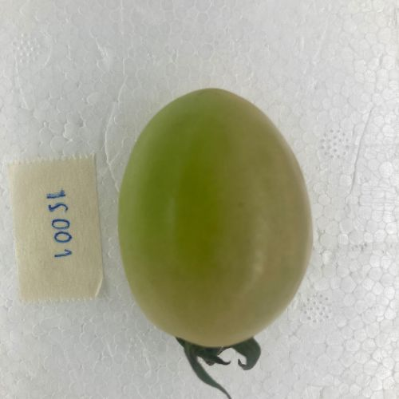
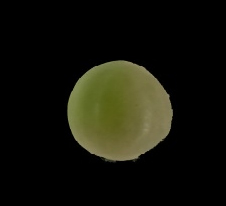

# Tomato Quality AI: End-to-End Carotenoid Prediction

## 📌 Overview
This project focuses on predicting carotenoid content (e.g., Beta-carotene, Lycopene, Lutein) from tomato images using computer vision and deep learning models. 


This repository contains the Regression version of the project. For the earlier Classification work (5-class), please refer to our IEEE TENCON 2024 publication.

---

## 🖼️ Visual Proof & Performance
| Original Input | Background Removed | Grad-CAM Visualization |
|:---:|:---:|:---:|
|  |  |  |

### 📊 Benchmarks (Mean Absolute Error)

Results below reflect the model performance. Units are in **mg/kg**.

| Model | Lutein | $\beta$-carotene | Lycopene |
| :--- | :---: | :---: | :---: |
| **ResNet34 (SOTA)** | **0.21** | **0.24** | **0.53** |
| ResNet50 | 0.22 | 0.26 | 0.59 |
| EfficientNet-B0 | 0.29 | 0.29 | 0.56 |
| Custom CNN | 0.23 | 0.39 | 0.61 |

---

## 🛠️ Preprocessing Pipeline
Raw tomato images are transformed into model-ready data through the following strictly validated steps:
1. **Load image** from dataset.
2. **Remove background** using optimized color thresholding ($Lower: [0, 70, 0], Upper: [255, 255, 255]$).
3. **Resize** to 224 × 224 pixels.
4. **Normalize** pixel values (0-1).
5. **Match image** with carotenoid value from CSV.
6. **Split** into train / validation / test sets.
7. **Save** as NumPy arrays (`.npy`) for efficient loading.

---

## 📂 Project Structure
```
├── app/
│   └── main.py              # FastAPI implementation for high-performance model serving
├── src/
│   ├── data_loader/         # Custom dataset handling and batch loading logic
│   ├── evaluation/          # Model performance metrics and validation scripts
│   ├── inference/           # Core predictor engine (Ensures Training-Serving parity)
│   ├── models/              # Architecture definitions: ResNet, EfficientNet, and Custom CNN
│   ├── preprocessing/       # Image processing pipeline: Thresholding, resizing, and normalization
│   ├── training/            # Unified training loop with Early Stopping integration
│   └── utils/               # XAI (Grad-CAM), post-processing, and helper utilities
├── data/                    # Raw and processed datasets (Not tracked in Git)
└── weights/                 # Trained model checkpoints (.pth)
```
### CSV Format
```csv
folder,carotenoid_level
sample1,12.5
sample2,18.2
```

---

## 🚀 How to Run

### 1. Preprocess Dataset
```bash
python scripts/preprocess_dataset.py
```

### 2. Training (Example)
```bash
python scripts/train_lycopene_resnet34.py
```

### 3. Local Inference (Validated Consistency)
Test prediction on a single image:
```bash
python scripts/test_inference.py --image path/to/tomato.jpg --model resnet34
```

### 4. API Deployment (FastAPI)
Run the production-ready API server:
```bash
uvicorn app.main:app --reload
```
Interactive docs available at `http://127.0.0.1:8000/docs`

---

## 🧪 Consistency & Robustness
We guarantee **Preprocessing Parity**:
1. The inference pipeline reuses the exact `image_processor.py` logic used during training.
2. Verified identical outputs between **Local Scripts** and **API Endpoints** across multiple samples.

---

## 📝 Notes
* Only sample data is included in this repository.
* Full dataset is proprietary and not provided.
* Models are export-ready for **Mobile Deployment** (TFLite/ONNX).


---

## Author
**Kasidit Ruaydee**

